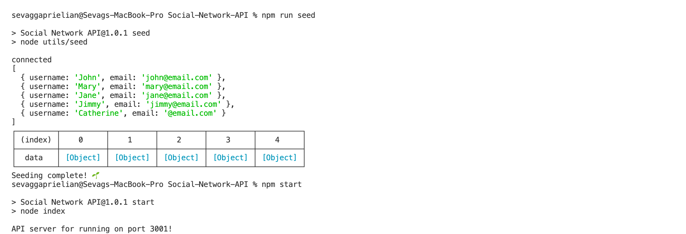
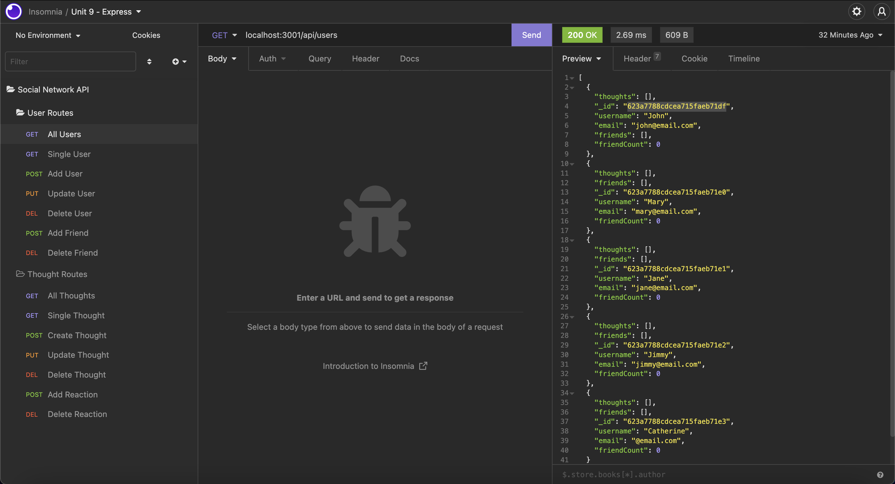
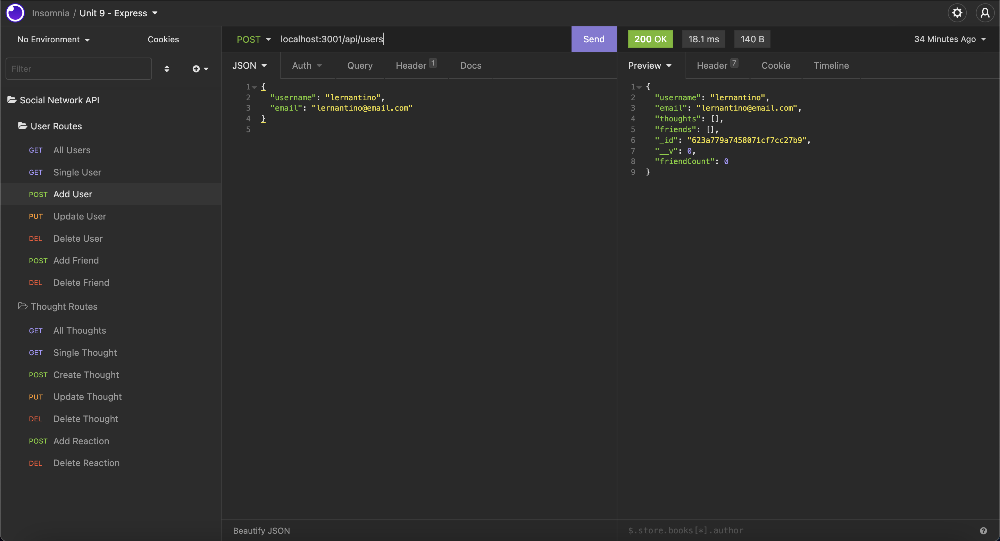

# Social-Network-API

## Table of Contents
* [Description](#desc)  
* [Installation](#install)  
* [Usage](#usage)  
* [Credits](#credits)  
* [License](#license)  
* [Github](#github)  

## Description

MongoDB is a popular choice for many social networks due to its speed with large amounts of data and flexibility with unstructured data.

The purpose of this project was to build an API for a social network web application where users can share their thoughts, react to friends’ thoughts, and create a friend list. The application uses Express.js for routing, a MongoDB database, and the Mongoose ODM. In addition to using the Express.js and Mongoose packages, the application uses the native JavaScript Date object to format timestamps.

## Installation

Once the repository is cloned, open the folder in an Integrated Terminal in Visual Studio Code. Run the npm seed command to seed the pre-existing user data into the database. Once this is done, run the npm start command to start the server. Navigate to Insomnia to test the routes. Happy Testing!

## Usage
The following image shows the application's appearance and functionality.

The terminal should appear as follows after running the commands in the installation section:

The application should appear as follows when performing a GET route for view all users:

The application should appear as follows when performing a POST route to add a user:

 
## Credits
Uoft SCS Coding Bootcamp Gitlab

 
## License
Copyright [2022] [Sevag Gaprielian]

Licensed under the Apache License, Version 2.0 (the "License"); you may not use this file except in compliance with the License.
You may obtain a copy of the License at http://www.apache.org/licenses/LICENSE-2.0.

Unless required by applicable law or agreed to in writing, software
distributed under the License is distributed on an "AS IS" BASIS,
WITHOUT WARRANTIES OR CONDITIONS OF ANY KIND, either express or implied.
See the License for the specific language governing permissions and
limitations under the License.

 
## GitHub
Github: sevaggap  
Walkthrough Video: https://drive.google.com/file/d/1DCJ12FhGCpaq0DmeppzCb0qAz8T4LDrA/view?usp=sharing